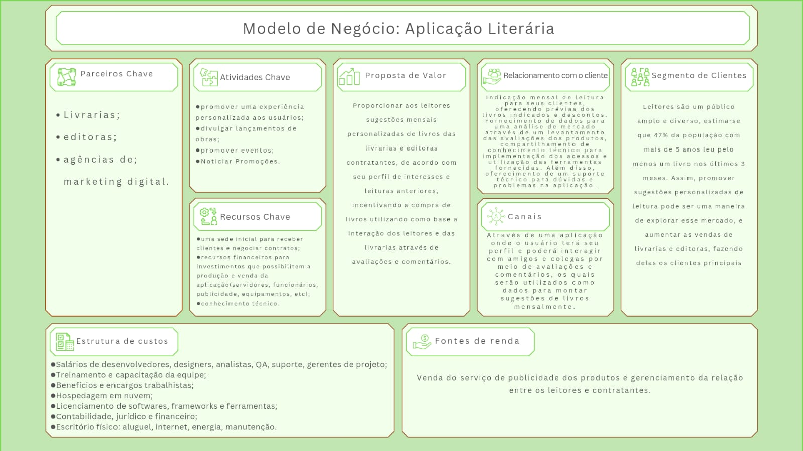

## **Alivraria**

1. Resumo:
   
   A proposta da Alivraria é ser uma plataforma interativa voltada para leitores. Que ofereça uma nova experiência para amantes da leitura. A partir da criação de um perfil os usuários poderão receber recomendações personalizadas de obras e lançamentos do mundo literário. A aplicação também será um espaço de interação entre leitores e autores, onde poderão discutir sobre suas obras favoritas e participar de eventos presenciais organizados para os usuários da plataforma.

2. Principais dores:
  - Falta de ambiente especializado para reunião de leitores e discussão literária
  - Falta de um serviço personalizado de recomendação literária
  - Falta de estímulo à leitura
   
3. Modelo de negócio:

 	
   
4. Requisitos de alto nível:
 - Para usuários cadastrados e com assinatura o sistema deve permitir que eles acessem as primeiras páginas de qualquer livro disponível na plataforma;
 - O sistema deve disponibilizar formulários de perfil literário, no qual serão feitas perguntas relacionadas com seu gênero, autores e livros favoritos, médias de leitura anual, entre outras perguntas;
 - O sistema deve exibir links de redirecionamento para sites onde o livro desejado pelo usuário pode ser adquirido ou lido na íntegra;
 - O sistema poderá disponibilizar descontos e benefícios nas compras para seus usuários;
 - O sistema deve apresentar uma funcionalidade de “caixa misteriosa” para usuários assinantes. Podendo acontecer de duas maneiras, de acordo com o perfil (gênero literário, faixa etária) ou por uma seleção completamente aleatória;
 - O sistema deve apresentar um campo para os usuários adicionarem outros usuários, sendo como uma lista de amizade;
 - O sistema deve apresentar um ambiente de comunidade, no qual permitirá o usuário interagir com outros usuários;
 - O sistema deve ter diversos eventos para permitir maiores interações entre os usuários, como concursos de escrita, debates literários, clubes de leitura, troca de livros, entre outros. Podendo ser realizados online e presencialmente;
 - O sistema deve ter um ambiente focado apenas em livros. Ou seja, todo o seu conteúdo será voltado para o público leitor.

5. Tecnologias que serão usadas:
   - React(Frontend)
   - Node.js(Backend)
   - AWS(Banco de dados)
     
6. Integrantes e Responsáveis:
    - Node.js - Lana Lumi, 
    - React - Mirella Faria, Lana Lumi
    - AWS - Maria, Camila
